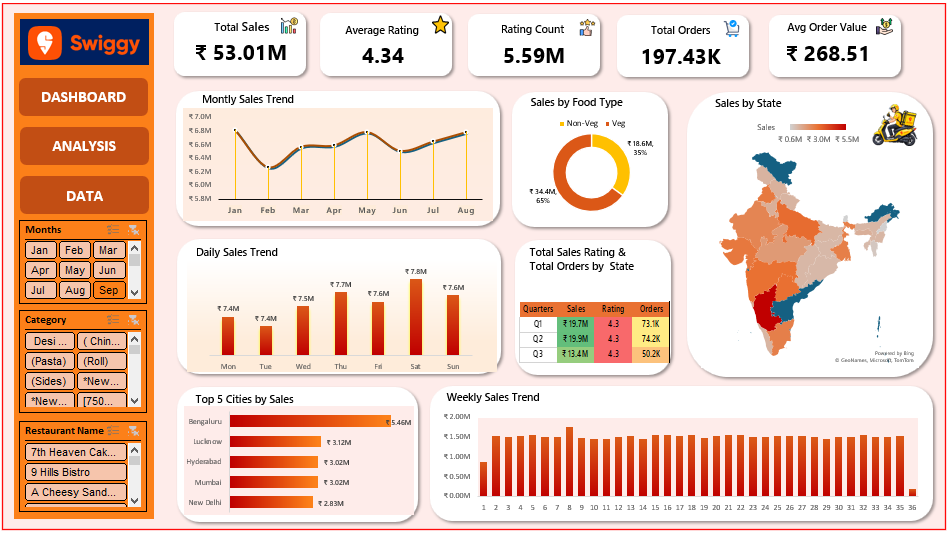

# 📊 Swiggy Data Analysis & Interactive Dashboard Using Excel

## 📌 Project Overview

This project focuses on analyzing Swiggy food-ordering data using Microsoft Excel and transforming the dataset into meaningful business insights through data cleaning, analysis, visualization, and dashboard development.

The project explores restaurant information, food categories, pricing, customer ratings, locations, and time-based ordering patterns.

## 🎯 Objectives

* Analyze Swiggy food-ordering data to identify meaningful patterns.
* Understand restaurant, city, state, and food-category distribution.
* Analyze food prices and customer ratings.
* Identify popular restaurants and food categories.
* Perform time-based analysis using order dates, days, weeks, and quarters.
* Create an interactive Excel dashboard for data visualization.
* Generate actionable insights from the analyzed data.

## 🛠️ Tools & Technologies

* Microsoft Excel
* Pivot Tables
* Pivot Charts
* Slicers
* Excel Formulas
* Data Cleaning
* Data Analysis
* Data Visualization

## 📌 Analysis Performed

* State-wise distribution
* City-wise distribution
* Restaurant performance
* Food category distribution
* Food type analysis
* Price analysis
* Customer rating analysis
* Rating count analysis
* Time-based trends
* Restaurant and dish-level analysis

## Dashboard

The Excel dashboard provides an interactive view of the analyzed Swiggy data using charts, KPIs, filters, and visualizations.

### Dashboard Preview

## 💡 Key Insights

* Analyzed the distribution of restaurants across different locations.
* Identified trends in food categories and food types.
* Compared food prices across different categories.
* Examined customer ratings and rating counts.
* Analyzed ordering patterns across different days, weeks, and quarters.
* Identified important restaurant and food-related trends from the dataset.

## Project Files

| File                                  | Description                           |
| ------------------------------------- | ------------------------------------- |
| `Swiggy_Data_Analysis_Dashboard.xlsx` | Complete Excel analysis and dashboard |
| `Swiggy_Raw_Data.xlsx`                | Raw dataset                           |
| `Swiggy_Dashboard.png`                | Dashboard preview                     |

## 📍 Skills Demonstrated

▪️ Data Cleaning
▪️ Data Analysis
▪️ Excel Dashboard Development
▪️ Data Visualization
▪️ Pivot Table Analysis
▪️ Business Insights Generation

## Conclusion

This project demonstrates the use of Microsoft Excel to transform raw food-ordering data into an interactive analytical dashboard. The analysis provides insights into restaurant distribution, food categories, pricing, customer ratings, and time-based patterns.

The project helped strengthen practical skills in data cleaning, exploratory analysis, visualization, dashboard development, and business insight generation.
